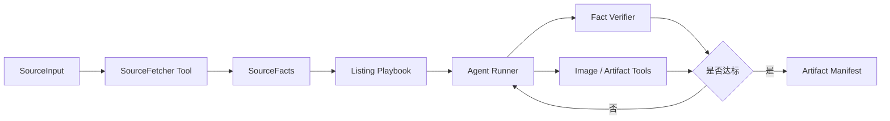

# Agent SDK 设计

阶段四采用 Claude Agent SDK 的核心原因不是继续增加 Agent 数量, 而是把长任务执行、工具调用、文件上下文和交付检查放进同一个闭环。

## 边界划分

## 工具保持薄封装

公开代码切片里的 `src/tools/` 只展示工具契约:

- `source_fetcher_contract.py`: 货源读取工具返回什么结构。
- `fact_verifier_example.py`: 买家可见内容如何做事实和语境检查。
- `artifact_checker.py`: 最终图片资产如何做数量和文件检查。

真实生产代码中会有平台抓取、VLM 调用、图片合成、数据库写入和模型配置。本仓库不公开这些细节, 因为它们不是面试官判断 Agent 工程能力所必需的部分, 也可能包含平台和环境信息。

## Playbook 承载业务判断

`playbooks/listing_agent_playbook.md` 展示的是上架 Agent 的可复用规则:

- 先判商品主体, 再判图片任务。
- 不同品类使用不同主图职责。
- 买家可见文案不能出现内部过程词。
- 不确定事实宁可空缺, 不补猜。
- 交付前必须检查最终图片和素材包。

这比把所有判断写死在工具里更适合 Agent 系统: 工具负责 IO 和确定性检查, playbook 负责业务策略, runner 负责推进和修正。

## 公开 runner 的作用

`src/runner_example.py` 不是生产入口, 它展示工程形状:

1. 接收 `SourceInput`。
2. 通过 source fetcher 得到 `SourceFacts`。
3. 根据 playbook 形成 `ListingPlan`。
4. 用 fact verifier 检查标题、属性和图片文案。
5. 用 artifact checker 检查最终交付文件。
6. 输出质量报告。

这个切片的目标是证明项目不是只有展示页, 而是有清晰的 Agent 执行边界和交付验收逻辑。
