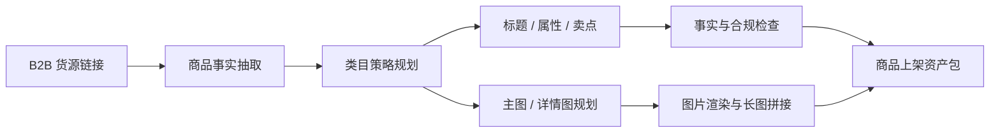
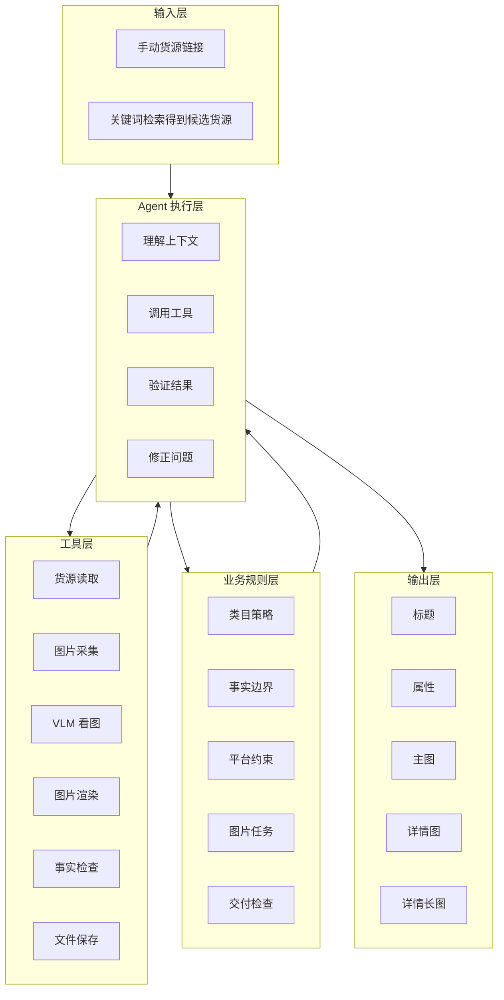
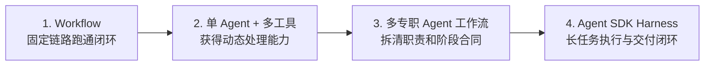
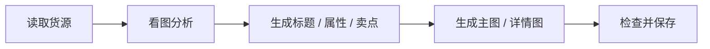
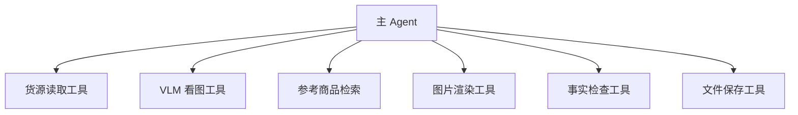
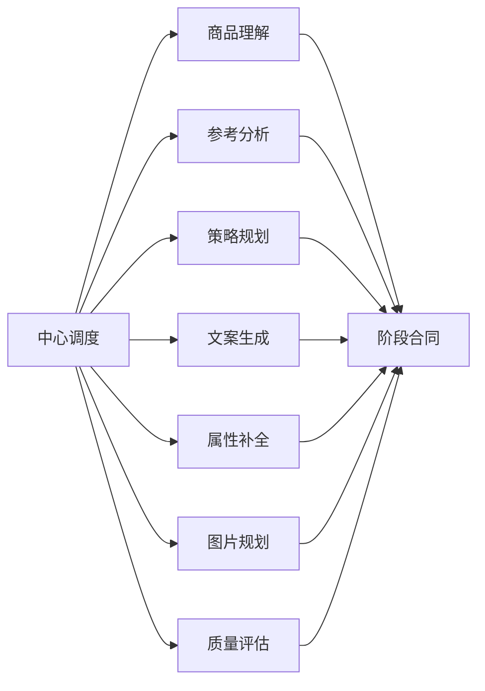
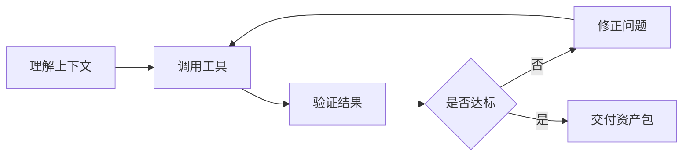
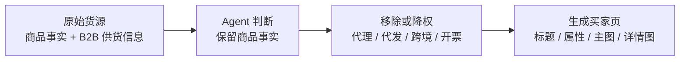

# 工程架构与演进

这个项目的核心问题不是“让模型写一段商品文案”, 而是把一个 B2B 货源链接稳定转成一套可发布的商品资产。系统需要同时处理网页信息、图片素材、平台规则、事实约束、图片排版和最终交付。

## 一眼看懂

最终交付的不是单一文本, 而是一套 listing package: 商品标题、类目属性、卖点与详情文案、5 张主图、多屏详情图和拼接后的详情长图。

## 系统分层

这个分层的关键是让工具保持薄封装, 让业务规则沉淀为可复用 playbook, 再由 Agent 执行层负责长任务推进、验证和修复。

## 架构演进

### 阶段一: Workflow

最早的实现先用固定工作流跑通闭环。这个阶段证明了 B2B 货源可以被转换成 C 端商品页资产, 但也暴露了固定流程的边界: 不同货源的素材质量、类目重点和页面结构差异很大, 只靠固定步骤很难做出足够细的判断。

### 阶段二: 单 Agent + 多工具

第二阶段给 Agent 增加了“手和眼睛”, 让它可以根据货源情况动态处理, 不再完全依赖固定模板。

新的问题是职责过重: 一个 Agent 同时负责看货源、定策略、写文案、填属性、规划图片、调工具和质检。任务链路变长后, 质量问题不再只是“模型写得好不好”, 而是任务拆解、状态追踪、阶段检查和失败恢复是否足够稳定。

### 阶段三: 多专职 Agent 工作流

这一阶段更接近 Specialist-Agent Pipeline, 不是完全自治的多 Agent 群聊。它解决的是职责边界问题: 商品研究、策略、文案、属性、图片和质检本来就是不同类型的判断, 拆开以后每个阶段可以拥有更明确的输入、输出和质量标准。

关键工程设计包括:

- 用结构化 schema 作为阶段合同。
- 卖点按 Feature / Advantage / Benefit / Evidence 拆分。
- 对标题长度、图片角色、详情屏数量设置硬约束。
- 在生成后做事实检查和交付检查。

### 阶段四: Agent SDK Harness

第四阶段的重点不是继续增加 Agent 数量, 而是把业务逻辑迁移到更成熟的 Agent 执行系统中。

在这个结构里:

- 工具负责清晰的 IO: 拉取素材、看图、渲染、校验、保存。
- playbook 负责业务规则: 类目策略、事实边界、平台限制、图片任务和交付检查。
- harness 负责长任务执行: 上下文管理、工具调用、阶段推进、验证和修复。

这让系统从“脚本驱动的一次性生成”变成“带检查点的长链路交付”。

## 桌布案例为什么适合展示

桌布案例的原始货源中混合了商品事实和大量供货信息。最终输出需要保留商品本身, 同时把供货语境转换成消费者能理解的商品页表达, 这正好覆盖了 Agent 的理解、规划、生成、校验和交付能力。

## 架构判断

1. Workflow 和 Agent 不是对立关系。明确、可预测、强约束的步骤适合 workflow; 需要根据上下文动态判断的环节适合 Agent。
2. 工具不是越多越好。工具解决能力边界, 但不自动带来交付质量。工具越多, 越需要状态追踪、阶段合同和失败恢复。
3. 多 Agent 不是默认更高级。只有当任务天然包含多个专业角色和不同评价标准时, 拆分职责才有价值。
4. Agent 产品质量最终取决于 harness。上下文工程、权限边界、工具调用、验证闭环和交付检查, 决定了系统能否稳定产出。

更多关于不同架构阶段产物问题如何推动迭代, 见 [评估与迭代经验](evaluation-and-lessons.md)。
