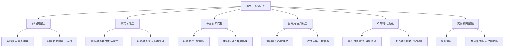
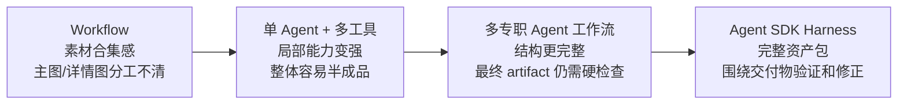

# 评估与迭代经验

这个项目的评估目标不是给模型输出打一个笼统分数, 而是判断一套商品上架资产是否真的可发布、可复核、可迭代。

完整评测中心已经作为独立项目展示。本文件只保留商品上架 Agent 仓库需要的质量边界和迭代经验, 不重复放 grader 代码。

## 评估维度



这套评估关注三类问题:

- 能不能跑完: 链路是否稳定, 文件是否完整生成。
- 能不能发布: 标题、属性、主图、详情图是否达到平台基本门槛。
- 值不值得发布: 是否完成从 B2B 货源页到 C 端商品页的转译。

## 不同架构阶段的产物变化



### 阶段一: Workflow

固定工作流可以把链路跑通, 但产物常常像“素材整理结果”, 还不像真正的商品页。

```text
产物形态:
- 标题和属性已经能从货源页抽取。
- 主图和详情图能生成, 但更像模板拼装。
- 同一批源图会被反复裁切和复用。

典型问题:
- 主图缺少明确分工, 铺桌效果、尺寸、细节、白底确认没有被拆开。
- 详情图重复, 缺少从场景到规格再到服务的节奏。
- 文案容易停留在“材料是什么”, 没有转成买家为什么想买。
- 图片文字可能压在复杂花纹背景上, 可读性不稳定。
```

以桌布类商品为例, 早期结果能说明“这是棉麻桌布”, 但很难同时回答买家关心的几个问题: 铺上桌是什么效果、有哪些尺寸、面料纹理如何、边缘垂坠怎样、购买前怎么确认款式。

这推动了下一阶段: 让 Agent 拥有工具, 能根据货源素材状态动态判断下一步。

### 阶段二: 单 Agent + 多工具

单 Agent 接入货源读取、VLM 看图、参考检索、图片渲染和事实检查后, 产物开始具备动态处理能力, 但容易出现“局部不错、整体未闭环”的状态。

```text
产物形态:
- 卖点和属性比固定 workflow 更像商品页。
- Agent 能选择工具处理不同货源, 不再只是套固定模板。
- 部分图片能按场景、尺寸、质感等任务生成。

典型问题:
- 正文可能为空或过短。
- 主图数量可能不足, 或某张主图混入详情/参数信息。
- 标题可能混入英文、供货词或不适合平台发布的词。
- 品牌、材质、规格等字段可能被工具返回值污染。
```

这一阶段的核心经验是: 工具解决的是能力边界, 不是交付质量。Agent 能调用更多工具以后, 系统真正需要的是任务拆解、阶段合同和最终交付检查。

这推动了下一阶段: 把商品理解、策略、文案、属性、图片规划和质检拆成专职阶段。

### 阶段三: 多专职 Agent 工作流

多专职 Agent 工作流让产物明显更结构化。每个阶段有自己的输入、输出和质量标准, 上架内容开始从“能生成”走向“更可控”。

```text
产物形态:
- 标题、属性、卖点、正文基本完整。
- 卖点开始有 Feature / Advantage / Benefit / Evidence 结构。
- 主图不再全部是同一种版式。
- 详情图数量更稳定, 页面节奏更接近商品详情。

典型问题:
- 规划质量变好, 但最终图片 artifact 仍可能出问题。
- 评估 Agent 可能给高分, 但没有真正读取最终生成图片。
- 工具失败后可能静默产出空白图、暗图或不可发布图片。
- 源图、事实、生成图和校验结果没有统一持久化时, 追踪 root cause 困难。
```

这一阶段说明, 多 Agent 能解决职责边界, 但不能自动解决长链路交付。最终交付物是否真的可发布, 还需要围绕 artifact 的验证、修复和状态管理。

这推动了下一阶段: 从自研管线转向更成熟的 Agent SDK harness。

### 阶段四: Agent SDK Harness

Agent SDK 版本的重点不是继续增加角色, 而是把业务规则沉淀为 playbook, 让 Agent 在成熟 harness 中围绕最终交付物持续执行、验证和修正。

```text
产物形态:
- 输入是一条货源链接或检索得到的候选货源。
- 中间过程形成结构化计划: 商品事实、类目策略、主图任务、详情任务、校验规则。
- 输出是完整 listing package: 标题、属性、主图、详情图、详情长图。
- 交付前检查图片数量、尺寸、事实边界、标题规则和公开文案。

当前桌布案例:
- 标题: 棉麻花朵桌布地中海风长方形餐桌台布
- 主图: 铺桌首图 / 尺寸规格 / 面料纹理 / 边缘垂坠 / 浅底确认
- 详情图: 场景、卖点、面料、尺寸、款式、规格和服务信息
- 详情长图: 8 屏详情图拼接成完整发布资产
```

这个阶段更像一个长期工作的 Agent 系统: 工具层只做清晰 IO, 业务规则写进 playbook, harness 负责上下文、工具调用、检查点和修复循环。

## 产物问题如何推动架构升级

| 产物问题 | 表面现象 | 根因判断 | 架构动作 |
|---|---|---|---|
| 主图重复、详情图模板感重 | 能生成, 但不像商品页 | 固定流程缺少素材判断 | 从 workflow 升级到 Agent 调工具 |
| 正文为空、主图数量不足 | 局部字段不错, 整体半成品 | 单 Agent 职责过重, 没有阶段合同 | 拆成专职阶段和结构化 schema |
| Judge 高分但图片不可发布 | 规划正确, artifact 失败 | 评估没有围绕最终交付物 | 加最终图片检查和硬门槛 |
| 供货语境进入买家页 | 出现代理、代发、跨境等信息 | B2B 语境和 C 端表达没有分层 | 明确事实边界和公开文案规则 |
| 源图复用与事实校验困难 | 失败后难追踪 | 中间状态没有稳定持久化 | 建立 artifact / trace / check 体系 |

## 从“看起来不错”到“知道哪里变好了”

这个项目的评估思路经历了一个变化:

```text
人工看效果 -> 记录失败模式 -> 抽象质量维度 -> 建立检查规则 -> 回归验证
```

最终目标不是证明某一次输出好看, 而是让系统知道:

- 哪类失败减少了。
- 哪类失败仍然高发。
- 问题发生在货源理解、策略规划、文案生成、图片渲染还是最终检查。
- 下一轮应该修工具、修 playbook, 还是修 harness。

这也是为什么评估文档和架构文档要放在一起: 对 Agent 产品来说, 架构不是一次设计出来的, 而是被真实交付问题持续推出来的。
